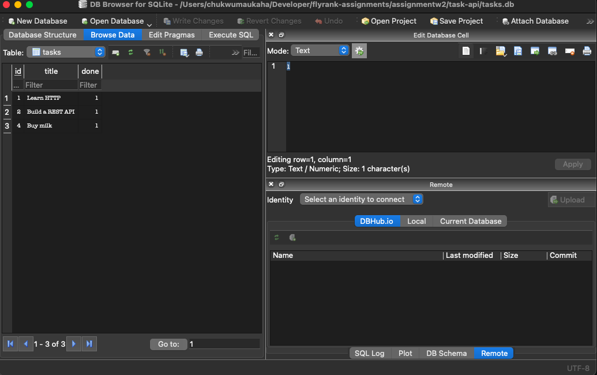

# Task API

A small in-memory CRUD API for managing a to-do list, built with Node.js and Express.
Part of the FlyRank Backend Track (Week 2, Assignment A1).

> Note: tasks live in memory only — they reset to the 3 seed tasks every time the server restarts. No database yet (that's Week 3).

## Install & run

```bash
npm install      # install dependencies
node server.js   # start the server on http://localhost:3000
```

Interactive docs (Swagger UI): http://localhost:3000/docs

## Endpoints

| Method | Path         | Description       | Success | Errors   |
|--------|--------------|-------------------|---------|----------|
| GET    | /            | API info          | 200     | —        |
| GET    | /health      | Health check      | 200     | —        |
| GET    | /tasks       | List all tasks    | 200     | —        |
| GET    | /tasks/:id   | Get one task      | 200     | 404      |
| POST   | /tasks       | Create a task     | 201     | 400      |
| PUT    | /tasks/:id   | Update a task     | 200     | 400, 404 |
| DELETE | /tasks/:id   | Delete a task     | 204     | 404      |

## Example request

```
% curl -i -X POST http://localhost:3000/tasks -H "Content-Type: application/json" -d '{"title":"Buy milk"}'
HTTP/1.1 201 Created
X-Powered-By: Express
Content-Type: application/json; charset=utf-8
Content-Length: 40
ETag: W/"28-gPXr/tBcmKMXZwSEhav9o8e9gYc"
Date: Mon, 10 Aug 2026 15:02:00 GMT
Connection: keep-alive
Keep-Alive: timeout=5

{"id":5,"title":"Buy milk","done":false}%  

```


## Swagger UI


## Why SQLite?

It's a single file with zero setup — no separate database server to install or run — and unlike the in-memory array, the data survives restarts. Perfect for a small project or local development.

## Where does the database live?

The database lives in the tasks.db file, in the project root, created automatically on first run, and git-ignored so every clone starts fresh with its own copy and the three seed tasks.

## How to run it:

```bash
npm install      # installs express, swagger-ui-express, AND better-sqlite3
node server.js   # creates tasks.db (if missing), seeds it, starts on :3000
```
## A DB Browser screenshot


## Exploring the database

Opened `tasks.db` in DB Browser and ran:

```sql
UPDATE tasks SET done = 1;

chukwumaukaha@Chukwumas-MacBook-Air task-api % curl -i http://localhost:3000/tasks
HTTP/1.1 200 OK
X-Powered-By: Express
Content-Type: application/json; charset=utf-8
Content-Length: 131
ETag: W/"83-Z9+iKELprjJRCQd6DRcGi6dkiBg"
Date: Tue, 11 Aug 2026 03:56:00 GMT
Connection: keep-alive
Keep-Alive: timeout=5

[{"id":1,"title":"Learn HTTP","done":true},{"id":2,"title":"Build a REST API","done":true},{"id":4,"title":"Buy milk","done":true}]% 
```

Then `GET /tasks` immediately returned every task as `"done": true` — with no server restart. The API and DB Browser read the same file, so there's one source of truth.

Because the API contract didn't change, moving from an in-memory array to SQLite produced byte-identical responses — GET /tasks returns the same body (same Content-Length, same ETag) as the in-memory version did. Identical responses passing the same tests is the proof that storage is just an implementation detail behind the API.