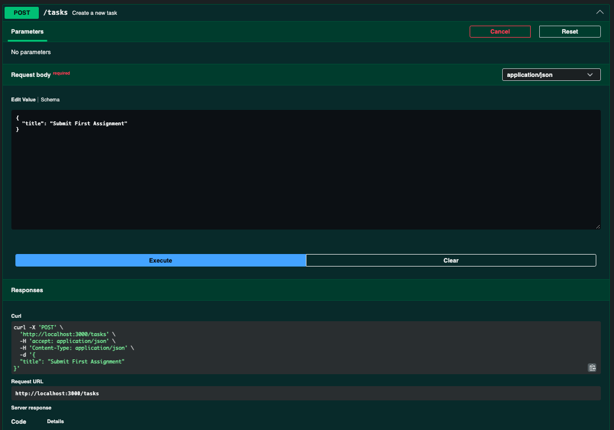
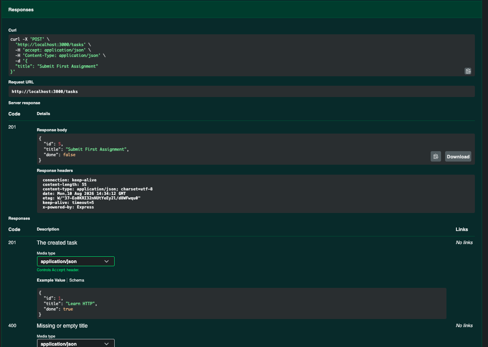

# Task API

A small in-memory CRUD API for managing a to-do list, built with Node.js and Express.
Part of the FlyRank Backend Track (Week 2, Assignment A1).

> Note: tasks live in memory only — they reset to the 3 seed tasks every time the server restarts. No database yet (that's Week 3).

## Install & run

```bash
npm install      # install dependencies
node server.js   # start the server on http://localhost:3000
```

Interactive docs (Swagger UI): http://localhost:3000/docs

## Endpoints

| Method | Path         | Description       | Success | Errors   |
|--------|--------------|-------------------|---------|----------|
| GET    | /            | API info          | 200     | —        |
| GET    | /health      | Health check      | 200     | —        |
| GET    | /tasks       | List all tasks    | 200     | —        |
| GET    | /tasks/:id   | Get one task      | 200     | 404      |
| POST   | /tasks       | Create a task     | 201     | 400      |
| PUT    | /tasks/:id   | Update a task     | 200     | 400, 404 |
| DELETE | /tasks/:id   | Delete a task     | 204     | 404      |

## Example request

```
% curl -i -X POST http://localhost:3000/tasks -H "Content-Type: application/json" -d '{"title":"Buy milk"}'
HTTP/1.1 201 Created
X-Powered-By: Express
Content-Type: application/json; charset=utf-8
Content-Length: 40
ETag: W/"28-gPXr/tBcmKMXZwSEhav9o8e9gYc"
Date: Mon, 10 Aug 2026 15:02:00 GMT
Connection: keep-alive
Keep-Alive: timeout=5

{"id":5,"title":"Buy milk","done":false}%  

```


## Swagger UI



