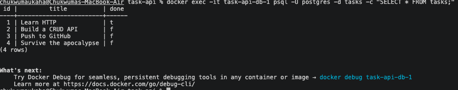

# Task API

A CRUD to-do API built with Node.js and Express. Storage has evolved across three assignments — in-memory array (A1) → SQLite file (A2) → **PostgreSQL in Docker (A3)** — while the API's routes and responses stayed identical the whole way. Storage is an implementation detail behind a stable API.

## Run it

```bash
cp .env.example .env      # create your local env file
docker compose up         # builds the app image, starts Postgres + API together
```

The API is at http://localhost:3000, Swagger docs at http://localhost:3000/docs.
The `tasks` table is created and seeded automatically on first run.

## Configuration
Take a look at the .env.example file to understand how to connect to the database. The original .env file is git-ignored

## Architecture

All database access lives in one module, `db.js` (the repository). The routes in `server.js` contain no SQL — they call repository functions. Moving from SQLite to Postgres changed only `db.js`; `server.js` was untouched. That's the proof that storage is an implementation detail: the same routes, request shapes, and responses work across all three storage engines.

## Endpoints

| Method | Path         | Description       | Success | Errors   |
|--------|--------------|-------------------|---------|----------|
| GET    | /            | API info          | 200     | —        |
| GET    | /health      | Health check      | 200     | —        |
| GET    | /tasks       | List all tasks    | 200     | —        |
| GET    | /tasks/:id   | Get one task      | 200     | 404      |
| POST   | /tasks       | Create a task     | 201     | 400      |
| PUT    | /tasks/:id   | Update a task     | 200     | 400, 404 |
| DELETE | /tasks/:id   | Delete a task     | 204     | 404      |

## Example request

```
chukwumaukaha@Chukwumas-MacBook-Air task-api % curl -i -X POST http://localhost:3000/tasks -H "Content-Type: application/json" -d '{"title":"Buy milk"}'
HTTP/1.1 201 Created
X-Powered-By: Express
Content-Type: application/json; charset=utf-8
Content-Length: 40
ETag: W/"28-gPXr/tBcmKMXZwSEhav9o8e9gYc"
Date: Tue, 11 Aug 2026 18:02:49 GMT
Connection: keep-alive
Keep-Alive: timeout=5

{"id":5,"title":"Buy milk","done":false}%  

```

## Data in Postgres

Queried the running database container directly:



## Swagger UI


Because the API contract never changed, each storage swap produced byte-identical responses — GET /tasks returns the same body (same Content-Length, same ETag) whether tasks live in memory, in SQLite, or in Postgres. Identical responses across three different storage engines are the proof that storage is just an implementation detail behind a stable API.